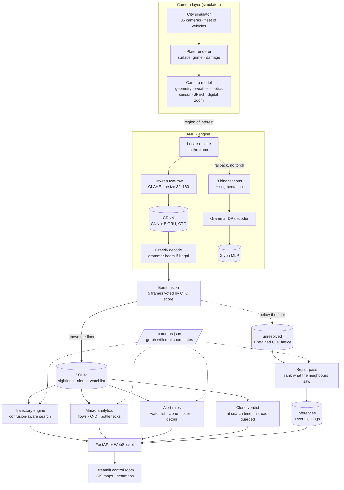

# 👁 GodsEye — city-wide ANPR intelligence platform

**SIH 2026 · Team Prometheus**
**Theme: Transportation & Logistics · Category: Software**  
**Problem statement: City-Wide AI Engine for Multi-Camera ANPR Trajectory Tracking and Urban Traffic Analytics**

Most cities already own the cameras. What they do not own is a system that joins
those cameras together — that can take one plate number and reconstruct where
that vehicle has been all day, and at the same time turn the same stream of
reads into a live picture of how the whole city is moving.

GodsEye is that layer: a plate reader built for bad photographs, a spatial-
temporal trajectory engine over a GIS camera network, macro traffic analytics
derived from the same reads, and a real-time alert queue on top of both.

**Where it stands.** The reader is at **73.1%** exact-plate accuracy on the burst
path it actually runs, and **96.2%** on the reads it is confident enough to store.
The brief asks for >90% and this does not meet it; §1 reports the measurement per
condition, says which conditions are information-limited and which are model
limits, and lists what has already been ruled out as the cause. The headline
table comes from `models/benchmark.json`, which the dashboard renders from the
same file so the two cannot disagree; the other measurements name the script or
probe that produced them.

---

## Run it

```bash
pip install -r requirements.txt

python seed.py                                  # 6 h of city traffic into SQLite (~65 s)
uvicorn api.main:app --reload --port 8000       # API + live feed  → http://localhost:8000/docs
streamlit run dashboard/app.py                  # control room     → http://localhost:8501
```

Both models are committed, so nothing has to be trained. If `models/` is
emptied, the CRNN has to be retrained deliberately (`python -m anpr.train_crnn`,
tens of minutes on CPU) while the classical fallback's glyph classifier retrains
itself on first use in about three minutes. Nothing here
needs a GPU, an internet connection, or a dataset download. To see the numbers
behind the accuracy claim, and to check every layer end to end:

```bash
python -m anpr.benchmark --samples 100 --scenes 60 --layouts 100 --burst 5 --json models/benchmark.json
python -m anpr.camera_sheet                     # see what the camera model produces
python -m anpr.compare_backends --samples 100   # CRNN vs the classical engine
python -m core.repair --hours 6                 # recover refused captures from the network
python tests.py                                 # end-to-end self-check (58 checks)
```

The dashboard reads the database directly, so it works with the API stopped —
the API process is what runs the live camera feed and the incident injectors.

---

## Architecture



---

## 1 · The plate reader

The hard part of ANPR is not clean plates. It is the 9 p.m. capture through
rain, at 30° off-axis, on a plate half covered in road grime. The engine is
built around that case.

**Pipeline.** Locate the plate in the frame → try each plausible row layout →
CLAHE and resize to 32×160 → CRNN → CTC decode, with a grammar-constrained beam
only when greedy returns something that is not a registration → fuse the burst.
No binarisation and no segmentation: on a plate that has been through a JPEG
encoder at 90 px wide, committing to character boundaries before recognising
anything is betting on information the image no longer holds.

*(The classical fallback — used only when torch or the weights are missing — is
the older shape: normalise, divide out the background field, Otsu, cluster into
rows, over-segment into atoms, and search the groupings. It is described further
down.)*

**It is benchmarked on what a gantry camera actually sends.** Captures are not
clean renders with filters over them: they come from a physical camera model
(`anpr/camera.py`) that starts from a pole five to eight metres up looking down
at the carriageway, and runs eight stages in the order the physics happens —
surface, geometry, atmosphere, illumination, optics, sensor, JPEG encoder, then
the operator's crop and digital zoom. The consequences dominate every weather
effect: the plate lands **40–260 px wide** in the sensor, gets compressed at
that size, and is then upscaled with its own artefacts. `AUGMENTATION.md` has
the full account, including the three calibration errors that were caught by
looking at a contact sheet rather than by reading the code.

**It reads the plates that are actually on the road.** One-row and two-row
layouts (motorcycles, autos and trucks carry two rows, and normalising both to
the same pixel height would halve the two-row characters, so the target height
follows the aspect ratio); white private and yellow commercial plates; and the
blue IND band of a High Security plate, which is removed with the frame rather
than read — left in, it eats the first character and costs ten points of
accuracy. Training and benchmarking run across ten typefaces, because Indian
plates are supposed to use one prescribed face and in practice use whatever the
shop had.

**The recogniser is a CRNN, and the reason is measurable.** The original
pipeline segmented the plate into characters and classified each one. That
scored 87% on the old filter-based corpus and **16%** on camera-realistic
captures, and the bottleneck was localised by elimination rather than guessed:
perspective rectification, decoder merge depth, atom caps and morphology kernels
each moved it by a point or less, while held-out glyph accuracy sat at 98% on a
training mix dominated by easy crops.

The structural problem is that **segmentation is a decision made too early**.
After a gantry capture has been through a JPEG encoder at 90 px wide and a 3x
digital zoom, the gaps between characters are not reliably in the image any
more, and a pipeline that must find them before recognising anything is betting
on information that is gone. A CRNN never makes that decision: a convolutional
stack slides across the plate, a bidirectional GRU carries context along it, and
CTC marginalises over every alignment between output columns and the string.
Character boundaries stay latent.

Head to head on identical captures:

| | segment-and-classify | CRNN |
|---|---|---|
| daylight | 55% | **92%** |
| night IR | 48% | **92%** |
| monsoon | 25% | 68% |
| night glare | 15% | 38% |
| dusk, high ISO | 5% | 38% |
| high speed | 3% | 37% |
| fog | 12% | 35% |
| far lane | 2% | 20% |
| cheap cam | 0% | 15% |
| storm | 0% | 0% |
| **overall** | **16.5%** | **43.5%** |
| **of what it stored** | 79% | **92%** |
| **per read** | 117 ms | **21 ms** |

`python -m anpr.compare_backends --samples 60 --json models/backend_comparison.json`
reproduces that table, and the committed JSON is the run it came from. Per-read
timings move with machine load — the accuracies do not. The classical engine is kept
as an automatic fallback: without torch, or without trained weights, the
platform runs exactly as it did before.

**Three things the measurements changed my mind about.**

*The plate grammar is now nearly redundant, and so is decoding effort in
general.* The grammar was worth several points when a per-character classifier
had no context to stop a `B` landing in a digit slot. The BiGRU sees the whole
plate and learns that structure from the data: greedy decoding scores 44.3%
against the grammar beam's 45.0%, and widening that beam from 12 to 128 moves the
number not at all (38.7% at every width on a second corpus).

The decisive measurement is stronger still. On 251 failed reads, the true plate
scored higher than the string the model emitted in **zero** of them — median gap
−0.586 against the truth. There is nothing left for a better search to find: the
model prefers the wrong answer, and every remaining point is a model problem, not
a decoding one. The default is therefore greedy, with the beam run only when
greedy returns something that is not a valid registration shape, which keeps the
registration shape well-formed *when the beam finds one*. It is not a hard
guarantee: if no pattern completes inside the beam, `constrained_decode` returns
the greedy string with an empty pattern, and nothing re-checks the grammar before
storage. The confidence floor is what actually keeps malformed reads out of the
database.

*My first beam search was wrong, and the measurement said so unambiguously.* It
scored **below** greedy (24.0% against 27.0%). A grammar can only remove illegal
strings, so losing to greedy means the search is broken — I had collapsed the
blank and non-blank path probabilities that CTC prefix beam search has to track
separately.

*The one-row/two-row decision cannot be made by a threshold at all.* Squashing a
motorcycle plate into a 32-pixel strip leaves each row about fourteen pixels
tall, so the two rows have to be unwrapped into one line first. Deciding that
from the canvas aspect ratio does not work — a camera crop carries margin and
perspective, so an ordinary single-row capture arrives at 2.4:1 and gets cut in
half. Deciding it from the horizontal ink profile does not work either, and the
measurement is what settled it: the profile test skipped 30% of genuine two-row
plates, which then read at **3.3%**, and misfired on 6.7% of single-row ones,
every one of which read at **0%** — splitting one line in half puts the back of
the registration in front of its own start.

So the decision is deferred to the recogniser, which is the same principle that
made the CRNN work in the first place: do not commit to a segmentation before
you have tried to read it. Every plausible layout — as-is, split at the ink
bands, split at the quietest row in the middle third — goes through the network
in one batch and the exact CTC score picks the winner, preferring a grammatical
read over an ungrammatical one. Worth +1.0 point measured in isolation on
identical plates.

**The classical decoder** (still the fallback) — classical pipelines commit to one
segmentation and then classify, so a smeared `KA` fused into one blob is
unrecoverable. Here the segmenter is allowed to cut too much, and a dynamic
program searches every way of grouping 1–3 adjacent atoms into characters —
with a third move available, dropping an atom as noise, because mud specks and
rivets segment like characters too. Each grouping is scored against the Bharat
plate grammar (`LL DD LLL DDDD`), which rules out whole families of errors: a
digit can never win a letter slot. Eight binarisation hypotheses are decoded and
the highest-scoring read wins.

**The classical classifier is trained in stages**, all on synthetic plates with
known ground truth:

1. *Segmentation-aligned* — plates pushed through the real segmenter, kept only
   where the box count matches the plate length, so every label is certain.
2. *Decoder-aligned self-training* — the stage-1 engine reads a fresh batch of
   hard plates; where the decode matches ground truth, the decoder's own
   character spans are harvested as labelled crops. This recovers exactly what
   stage 1 discards — merged characters, mud-covered strokes, fragments glued
   back together.

Held-out glyph accuracy: **98.7%** over 36 classes, from 53 665 training crops.
Plate-level accuracy is in the table below.

**Confidence is the exact probability CTC assigns to the string it decoded.**
The forward-backward recursions marginalise over every alignment between the
network's output columns and the registration, normalised per character so plates
of different lengths compare; the implementation is checked against
`torch.nn.CTCLoss` to 1e-4. `anpr/crnn.py::ctc_score` returns it.

That replaced a heuristic that walked the argmax path with a cursor, and the
measurement was brutal: over 700 captures it ranked correct reads *below* wrong
ones — **AUROC 0.367**, worse than a coin toss, with a median confidence of 0.000
on correct reads against 0.070 on wrong ones. Whenever the cursor mis-advanced,
every later character was searched in a window that no longer held it. The exact
computation scores **AUROC 0.974** on the same reads, and at the operating point
that holds 90% precision it keeps three times as many reads as the heuristic did.

That is what makes the confidence floor mean something. The platform stores 71%
of captures and what it stores is **96.2%** correct; a read below the floor is
discarded rather than shown. `cheap_cam` accepts only a fifth of its reads. For a
platform that puts a registration in front of a police officer, refusing to
answer is the correct answer — and `core/repair.py` gets a second chance at the
refusals later, from what the neighbouring cameras saw.

*(The classical fallback keeps its own definition — the weakest character times
the share of binarisation hypotheses that agreed — because the two quantities are
not comparable. Each backend is judged against its own floor, exposed as
`PlateRead.accepted`.)*

### Reading a burst, not a frame

A real ANPR node is triggered by a loop or a tripwire and takes several frames as
the vehicle crosses the zone — different distances, exposures and motion blurs of
the same plate. Reading only the middle one throws away every other look, and the
looks fail independently: measured over 250 vehicles across all ten conditions,
one frame reads 40.4% of plates and eight read 77.2% with identical weights.

The frames are decoded separately and voted, weighted by the exact CTC score,
which is what makes the vote work at all — a vote is only as good as its ability
to tell a confident frame from a lucky one. The reported confidence stays the best
single frame's, so the storage floor keeps the meaning it was calibrated with, and
how many frames agreed is reported separately as `agreement`.

`config.BURST_FRAMES` sets it (default 5; `GODSEYE_BURST=1` restores single-frame
reads). The ANPR Lab offers both modes side by side and shows what each frame read
on its own, because watching one frame lose the plate to glare and get outvoted is
the clearest way to see why the burst matters.

### Recovering the refusals

A capture below the confidence floor is not stored — but its CTC lattice is kept
for a while, because the neighbouring cameras have not reported yet. Once they
have, a candidate set exists that did not exist at capture time: whatever passed
this camera almost certainly appears in what its neighbours read, minutes either
side, and that turns an open-vocabulary problem over 36¹⁰ strings into closed-set
retrieval over a few hundred candidates.

It is deliberately **not** "work out which characters are missing and fill them
in". That cannot be built here: per-character CTC posteriors are peaked almost
everywhere, so 99.8% of characters come back above 0.9 confidence *including the
wrong ones*, and per-character confidence predicts per-character correctness at
AUROC 0.692. The engine knows which strings it doubts, not which character let it
down. So instead each candidate string is scored against the retained lattice and
ranked — which recovers the true plate as the top hit in **78%** of refused
captures, holding up as the candidate set grows (78% at ten candidates, 69% at
two hundred).

Acceptance needs a likelihood floor *and* a margin over the runner-up, which
together stand in for a "none of these" hypothesis — when the vehicle entered off
a road no camera covers the true plate is simply absent, and the best wrong
candidate still looks plausible. On 90 minutes of simulated traffic the pass
accepted 45 of 60 refused captures, all 45 correct against ground truth, and 38 of
those were genuine repairs of a wrong decode rather than borderline reads nudged
over the floor (`DL63AQ9205` → `DL10AD9265`, `WB51RJW5251` → `WB51KRP1254`).

Two rules keep it honest. Candidate sets are built from `sightings` and inferences
are written to `inferences`, so a plate the platform *guessed* can never become
evidence for another guess — without that, one mistake walks down a corridor and
the platform manufactures a journey nobody made. And plates already flagged as
clones are skipped, because this pass works by assuming plausible travel and would
otherwise reconstruct one coherent path from two real vehicles. It runs behind the
live feed (`config.REPAIR_LAG_S`), because half its evidence is the downstream
camera, which has not seen the vehicle yet at the moment the capture fails.

`python -m core.repair` runs the pass; `POST /api/repair/run` does it over HTTP.

### Reading a photograph

`read_frame()` takes a whole picture rather than a tight crop. A morphological
localiser proposes plate-shaped regions — a plate is a horizontal band of
tightly-spaced vertical strokes, which a gradient and a wide closing pull out of
a scene while leaving most of it behind — and each region is decoded at a few
insets, because a box that carries a strip of bumper into the binariser reads
worse than one cut slightly tight. The most confident legal read wins.

**When it finds nothing it says why.** The dashboard draws the regions it
examined and reports, in words, what failed: no plate-shaped region; regions that
held no arrangement of characters spelling a valid registration; or — most often —
a candidate that did decode, but below the confidence floor, which is reported
with the figure so an operator can see how close it came. That
matters because the honest answer to "why did my photo of a notebook page not
read?" is that this is a *number-plate* reader. The plate grammar rules out whole
families of misreads, and on the classical path it was worth several points; on
the CRNN path what actually refuses handwriting, signage and arbitrary text is
the confidence floor, which is why the refusal message quotes the floor rather
than the grammar. It is not a general OCR.

### Measured accuracy

The platform reads a **burst**, not a photograph: a camera is triggered as a
vehicle enters the zone and contributes several frames, which are decoded
independently and voted by CTC score. Both columns are reported because they
answer different questions — the single-frame column judges the recogniser, the
burst column judges the platform.

| Capture condition | Single frame | Burst (5) | Stored | Of stored, correct |
|---|---|---|---|---|
| daylight | 90% | 100% | 100/100 | 100% |
| night_ir | 92% | 100% | 99/100 | 100% |
| monsoon | 62% | 98% | 98/100 | 99% |
| dusk_highiso | 35% | 89% | 84/100 | 98% |
| night_glare | 41% | 87% | 83/100 | 100% |
| fog | 32% | 83% | 82/100 | 96% |
| high_speed | 41% | 80% | 80/100 | 94% |
| far_lane | 21% | 67% | 67/100 | 82% |
| cheap_cam | 10% | 27% | 20/100 | 80% |
| storm | 0% | 0% | 0/100 | — |
| **overall** | **42.4%** | **73.1%** | **713/1000** | **96.2%** |

1,000 plates, 100 per condition. Each is decoded once as a single frame and
again as a five-frame burst, so the run makes 6,000 reads — 427 s on a single CPU
core, 14 plates/s. The dashboard renders the same `models/benchmark.json` this
table is copied from, so the document and the running system cannot disagree:

```bash
python -m anpr.benchmark --samples 100 --scenes 60 --layouts 100 --burst 5 --json models/benchmark.json
```

By plate layout, single frame, 100 each: one row clean 46%, dirty 28%, damaged
37%, two rows 32%. On 60 composited whole-frame scenes the localiser found the
plate 57% of the time and the platform read it correctly 22%, at 0.51 s a frame.

**Against the >90% target: not met.** The platform reads **73.1%** of plates on
the burst path and 42.4% on a single frame. Of the captures it is confident
enough to store — 71% of them — **96.2%** are exactly right, and that is the
number an operator actually experiences, because a read below the floor is
discarded rather than shown. But it is not the number the brief asks for and it
is not quoted here as though it were.

Three conditions hold the average down, and they are not the same kind of problem.

* **`storm` scores 0% and should.** Ranking the true plate against 199 decoys
  under the exact CTC likelihood succeeds 2.5% of the time, which means the
  registration is not recoverable from those pixels by any method. Refusing it is
  correct behaviour, not a failure.
* **`cheap_cam` (27%) and `far_lane` (67%) are not pixel-limited** — which is
  what an earlier version of this document claimed. Their information ceilings
  are 75% and 95%: the plate is in the image and the recogniser is not finding it.
* Everything else lands between 80% and 89% on the burst path, and three
  conditions clear 95% — daylight and night_ir at 100%, monsoon at 98%.

**Where the remaining accuracy is.** Across all conditions greedy decoding reads
43.8%, while the true plate outranks 199 decoys 83.2% of the time. That ~40-point
gap is the recogniser, not the optics. It is also not the decoder: on 251 failed
reads, **zero** had the true plate scoring higher than the string the model
emitted, and widening the grammar beam from 12 to 128 moves nothing. The model
prefers the wrong answer, so what is left is a model problem.

**What has been ruled out, by experiment.** Capacity is not the limit — the
current 745k architecture and a 2.95M one both memorise 400 captures at 100%.
Schedule is not the limit — an 18-epoch run beat the shipped weights only at
epoch 1, then spent seventeen epochs with falling loss and flat accuracy, and
benchmarked 2 points *worse* head to head. What remains untested is the training
distribution: the model scores **4% on a clean, undegraded render** and gets
better as the image is degraded toward what it trained on, which means it has
learned this camera model's artefact signature rather than the shapes of the
glyphs. No scenario in the corpus has a digital zoom below 1.6, so it has never
seen a sharp plate.

**What the conditions are.** Each is a *site*, not a filter: a mounting height,
a distance, a lens, a shutter, an ISO and the weather, from which everything
else follows. `daylight` is a fast shutter at midday; `night_ir` is an infrared
illuminator on retroreflective sheeting, which is often *easier* than dusk;
`night_glare` puts an oncoming headlight in frame and fools the auto-exposure;
`monsoon` adds motion-blurred rain streaks, veiling and a wet lens that refracts
rather than dims; `fog` applies Koschmieder scattering scaled by path length;
`high_speed` is a shutter too slow for the road it polices; `far_lane` is the
far carriageway, where the plate lands at 45-90 px; `dusk_highiso`
is the worst hour, too dark for the shutter and no IR yet; `cheap_cam` is an old
low-bitrate encoder plus heavy digital zoom; `storm` is everything at once and
should be **refused**. Plate grime and physical damage are drawn independently,
so a filthy plate can also be a night shot in the rain.

**Limits, stated plainly.** These are synthetic plates rendered by
`anpr/plates.py` and shot through the model in `anpr/camera.py`, not photographs
of Indian traffic — the number is a measure of
the engine against a stated degradation model, not a field trial. The grime and
damage models cap their opacity below 1.0 on purpose: a character with no light
escaping it cannot be read by any system, and burying one under opaque mud would
only manufacture a lower number, not a more honest one. Nothing in the pipeline
is tied to the synthetic renderer: `ANPREngine.read()` takes any plate crop and
`read_frame()` takes a wider photograph, and both paths are exposed through the
API and the dashboard's upload box. The seam for a production upgrade is
`detect_plate_candidates()` — return boxes from a trained detector and the rest
of the pipeline is unchanged.

### Measured accuracy on real photographs

The table above is synthetic. This one is not: 532 real plate crops from Indian
roads — 494 hand-labelled dashcam frames, 25 HD mobile captures with
ground-truth text, 13 filename-labelled cars — read by each backend and scored
on **exact match of the whole registration**.

| Backend | xml (n=25) | car (n=13) | video (n=494) | **all (n=532)** |
|---|---|---|---|---|
| classical (synthetic-trained) | 16.0% | 7.7% | 4.5% | 5.1% |
| CRNN (synthetic-trained) | 0.0% | 0.0% | 1.0% | 0.9% |
| EasyOCR | 16.0% | 15.4% | 21.5% | 21.1% |
| **anpr_ocr, as shipped upstream** | 44.0% | 92.3% | 81.0% | **79.5%** |
| **anpr_ocr + this repo's decoder** | 68.0% | 92.3% | 92.1% | **91.0%** |

The two synthetic-trained backends scoring near zero on real photographs is the
same result recorded in `CLAUDE.md`: features learned from `anpr/camera.py`'s
rendering artifacts do not transfer to real lens and sensor statistics. That is
why the real path runs a recogniser pretrained on real plates.

Held out by vehicle instead — 8 splits, so the spread is visible rather than
hidden behind whichever seed ran last:

| | mean | min | max | spread |
|---|---|---|---|---|
| before | 53.8% | 34.7% | 81.1% | 46.4 pts |
| **after** | **93.8%** | **86.8%** | **97.1%** | **10.2 pts** |

Two independent things moved that number, and they are worth separating.

**The ground truth was wrong.** The 548 dashcam frames had no text labels, so
they had been grouped into 55 clusters of adjacent frames and one hand-typed
plate assigned per cluster. Adjacency is not vehicle identity: cluster 6 turned
out to hold six different vehicles under the label `MH47Y1124`, cluster 39 held
eight, and cluster 43 was thirteen frames of `MH03CS6266` and one of the plate
it was named after. **37% of frames carried a plate that is not the one in the
picture** — a ceiling no recogniser could ever have passed. Re-labelling them
one frame at a time (`real_plate_frame_labels.json`, 494 frames, 84 distinct
plates, 8 dropped as genuinely unreadable) moved the *unchanged* upstream
decoder from 48.7% to 79.5%. See `REAL_LABELS.md`.

**The recogniser was being under-driven.** `anpr_ocr` wraps a model whose own
card reports 98.42% on its held-out set, but it was being run through ppocr's
plain argmax with no notion of what a registration looks like. Three changes,
no retraining and no new data, took it from 79.5% to 91.0%:

- **Grammar-constrained beam decode.** Fold the 64 output classes onto the 36
  plate characters, run a CTC prefix beam search, propose every legal reading
  each beam admits, and rank those by the exact CTC score of the whole string —
  the same forward-backward recursion the CRNN uses, borrowed rather than
  reimplemented. This is what strips a state sticker off `MH02ER9194JH` and
  puts the dropped digit back into `MH02AQ229`. Measured against every
  ground-truth label in the corpus, 76/76 carry a real state code and 74/76
  match the plate grammar, so the constraint is safe — and an ungrammatical
  read is still returned when nothing legal is on the beam, so an unusual
  format degrades to the old behaviour instead of vanishing.
- **Two-row plates are cut and laid out as one row.** Every two-row plate in
  the corpus was misread — `MH04DW9020` → `MH04DWM020`, `MH01BU1852` →
  `MH01BU852`, `MH47AV6753` → `MH47AV753` — while single-row plates were
  near-perfect. The cause is geometric: the model's preprocessing preserves
  aspect at a fixed 48px height, so a square plate arrives 48×48 inside a
  320-wide canvas with roughly 20px per character row. Splitting at the gutter
  and stacking the rows side by side hands the same weights a
  single-row-shaped input. It is an additional candidate, never a replacement.
- **Legality outranks confidence** when choosing between the two. A well-formed
  registration at 0.64 beats an illegal string at 0.99: the illegal one cannot
  be a plate whatever the network thinks of it.

**Limits, stated plainly.** 532 crops over 118 vehicles is a small corpus, and
it is ~90% Maharashtra — a Kolkata deployment is being validated almost
entirely on plates from another state. The labels were read off the images by
eye, with the model proposing the grouping; where a plate could not be read
confidently the frame was dropped rather than guessed. The remaining 48 misses
are genuine recogniser errors, concentrated on one very low-contrast plate
(`MH03CS6266` → `MH03CG6266`) and on `Q`/`D` in `MH47Q5851`. Reproduce with:

```bash
python -m anpr.compare_backends --real-all          # per-source, no split noise
python -m anpr.compare_backends --real --seeds 8    # held-out vehicles, 8 splits
```

And end-to-end on whole photographs — the YOLOv8-OBB detector finding the plate
and the recogniser reading it, which is the path the platform actually deploys:

| whole photos, 8 splits | mean | min | max | spread |
|---|---|---|---|---|
| classical | 4.1% | 0.0% | 15.1% | 15.1 pts |
| CRNN | 3.1% | 0.0% | 5.3% | 5.3 pts |
| EasyOCR | 12.9% | 2.8% | 36.8% | 34.0 pts |
| **YOLOv8-OBB + anpr_ocr** | **91.5%** | **90.0%** | **94.8%** | **4.8 pts** |

Every seed clears 90%, and the spread is the tightest of any mode — the
detector contributes essentially no variance, which is consistent with it
finding a candidate region in 100% of real photos tried.

```bash
python -m anpr.compare_backends --real-frames --seeds 8
```

All three need `.venv-paddle` — paddle has no Python 3.14 wheels.

---

## 2 · Trajectory reconstruction

Type a plate — even a partial or misread one — and the engine returns the
vehicle's day: every camera it passed, in order, with timestamps, the road it
took between each pair, how long that leg took, the speed that implies, and the
compass heading.

**Search is confusion-aware.** An operator who types `KA05MJ1234` still finds
the vehicle a rain-blurred camera stored as `KA05NJ1234`, because candidates are
ranked by an edit distance that charges 0.4 rather than 1.0 for a substitution
the OCR engine is actually known to make (`0↔O`, `8↔B`, `5↔S`, `1↔I` …).

**The reconstruction says when it does not trust itself.** A leg whose implied
speed exceeds 160 km/h is flagged rather than drawn as fact. It does *not* assert
a clone on that basis — at this engine's accuracy a misread merges two vehicles
onto one registration and produces the same signature, so the verdict goes
through `core/clones.py` and its guards first (§5), and the page says which of
the two it thinks it is looking at. Long stops, and legs where the path had to be
inferred through intermediate cameras, are called out too. The map draws the road
polyline from the camera graph, not a straight line between dots.

**A successful read answers the next question too.** A plate on its own is a
string; the moment one resolves, the ANPR Lab and both read endpoints show where
that vehicle has been — every camera it passed, in order, on the map, with the
legs between them. There is no second search to run.

Also on the page: co-travellers (vehicles repeatedly seen at the same camera
within a couple of minutes — a convoy or a tail), and one click to put the plate
on the watchlist, after which every further sighting raises an alert.

---

## 3 · The map

The control room draws the network from its own link geometry: each road link
carries intermediate shape points, so the EM Bypass bends the way the EM Bypass
bends instead of running as a straight line between two dots, and a
reconstructed trajectory follows the road a vehicle must have taken. Layers can
be toggled independently — roads coloured by congestion, directional flow arcs,
camera sites sized by per-lane load and haloed by type, name labels, and the
last five minutes of reads fading with age — over a choice of Carto basemaps
that need no API token. Tooltips carry both directions of a corridor, because a
road that crawls inbound and runs free outbound is the normal case and an
average would hide it.

**Two rendering bugs found by driving the real browser** (Playwright against
Chrome, screenshotting and reading the console, rather than reasoning about the
code):

* pydeck compiles any bare string passed to a layer into a *data accessor*, so
  `width_units="pixels"` became `@@=pixels` — deck.gl looked for a column of
  that name, found nothing, and the path width resolved to NaN. Every road
  rendered as a viewport-sized coloured wedge over a hidden basemap, and the
  same bug made every text layer invisible. Enum constants have to be wrapped in
  `pdk.types.String`.
* the page refreshed by sleeping five seconds, clearing every cached query and
  rerunning the whole script. Streamlit renders *all* tab bodies, so that
  rebuilt four maps and remounted their canvases on a timer. The live map is now
  an `st.fragment` with `run_every`, each chart has a stable component key, and
  the cached queries carry their own TTL. Measured over four tab round-trips,
  six layer toggles and three refresh cycles in a browser session: **22 canvases
  and 3 WebGL contexts, constant, with no page errors** — against a growing set
  before, which is what eventually exhausts Chrome's context budget and blacks the
  map out. That was a live browser measurement; unlike every other number here it
  has no artefact in the repo to re-run, so take it as a report rather than as
  something you can reproduce from a command.

## 4 · Macro traffic analytics

Everything is derived from one primitive: two consecutive sightings of the same
plate at two cameras. That pair gives a distance and a time, hence a speed,
hence congestion — aggregated over every plate it gives the city.

| View | What it computes |
|---|---|
| Camera density | Reads per minute, normalised per lane, as a load index |
| Link flows | Volume and median speed on each road link, versus its free-flow speed |
| Bottlenecks | Ranked by **vehicle-minutes of delay caused**, not by slowness alone — a slow empty road is not a problem |
| Origin–destination | Where each plate entered and left the network, with median trip time; gateway-only for through-traffic demand |
| Movement heatmap | Each traversed link sampled along its polyline, weighted by volume × congestion, so heat follows the roads instead of pooling on junctions |
| Trends | Flow, unique vehicles and median network speed over time |
| Sector load | Reads and per-minute rate aggregated by city sector (`GET /api/analytics/sectors`) |

Speeds are only computed between *adjacent* cameras. Between two cameras that
are not neighbours the vehicle's route is inferred, so neither the distance nor
the speed would be a measurement of any particular road — those pairs feed the
O-D matrix instead.

---

## 5 · Alerts

Every sighting is checked as it lands, against a short history of the same
plate, so the cost is a couple of indexed lookups.

| Rule | Fires when | Severity |
|---|---|---|
| `watchlist` | a listed plate is seen anywhere | critical |
| `clone` | two sightings too far apart to be the same vehicle (>160 km/h implied over ≥3 km, both reads ≥0.70 confidence) | critical |
| `loitering` | the same camera passed 4+ times within 45 minutes | medium |
| `detour` | returns to a camera it already passed after covering 4× the direct distance — and ≥10 km travelled, within 40 min, across ≥3 distinct cameras | low |
| `speeding` | implied link speed > 1.6× free-flow, between *adjacent* cameras only — between non-adjacent ones the route is inferred, so the speed is not evidence | medium |
| `odd_hour` | three or more *distinct* cameras within a rolling hour, between 01:00 and 05:00 | low |

**Clones are also caught the moment an operator searches**, not only as a
sighting lands. The ingest-time rule above is rate-limited and needs both reads
above 0.70 confidence, so a clone already sitting in the history can slip through
it entirely. `core/clones.py` answers the question as a *query* instead, and
every candidate a plate search returns is screened on the way out — the flag
appears before the operator picks one, because whatever they do next assumes the
registration belongs to one vehicle.

The hard part is not finding an impossible leg; `reconstruct()` already does
that. It is that at this engine's accuracy a **misread merges two different
vehicles onto one registration and looks exactly like a clone**. Asserting a
clone from an impossible leg alone would convert the platform's own OCR errors
into accusations against real motorists. So a verdict has to survive three
cheaper explanations first:

* *it was a misread* — if a plate within OCR confusion distance was plausibly at
  that camera at that time, judged by its own sightings either side, that is a far
  more ordinary event than a cloned plate;
* *it was a weak read* — both ends must clear `CLONE_MIN_CONFIDENCE`;
* *it was geometry* — two cameras a few hundred metres apart turn ordinary clock
  skew into a huge implied speed, so pairs under `CLONE_MIN_KM` are ignored.

What survives is graded. One conflict is `suspected` and shown with its caveat;
several independent ones are `confident` and carry a lower bound on how many
vehicles are involved, from a greedy feasible-track cover. **Only `confident`
reaches the alert queue** — a suspicion on screen carries its qualification,
whereas the same suspicion in the queue becomes an item of record that somebody
later acts on without it. Screening 40 real plates takes under 10 ms, because a
clean plate costs one indexed query and a walk over consecutive pairs; the
expensive misread test only runs once a conflict actually exists.

`GET /api/plates/{plate}/clone-check` returns the verdict, the conflicts, and the
ones it ruled out with the reason.

Every threshold here was set by measuring against the seeded database, not by
taste. `detour` began as "took more than one hop", which fires on every ordinary
journey because sightings are sparse whenever a read is dropped; then as "drove
further than the direct distance". The 28 % figure belongs to a third variant —
1.6x the direct distance within an hour — which is what a commute looks like. It now needs a vehicle to return to a camera
it already passed after covering four times the direct distance, which picks out
4% of the plates seen. Alerts are de-duplicated per plate per rule within a
rolling window — 5 minutes for `watchlist`, 30 for `clone` and `loitering`, 45 for
`detour`, 120 for `odd_hour` — not once and for all, which is why a six-hour
replay raises 115 watchlist alerts on five plates rather than five.

A six-hour seeded day produces on the order of 185 alerts — one run gave 115
watchlist hits (five listed plates), 53 speeding, 14 detours, plus the scripted
clone and loiterer; another gave 123 / 45 / 18. The counts are not reproducible
from the seed alone: `history()` anchors its window to `time.time()`, and the
hour-of-day demand profile spans 0.1× to 1.0×, so seeding at 3 a.m. and at 6 p.m.
generate different amounts of traffic and therefore different alert volumes.

---

## What is real and what is simulated

| Real | Simulated |
|---|---|
| The OCR engine — CRNN, CTC decoding, confidence, burst fusion, repair | The camera feeds |
| The plate images it reads, including all degradations | Vehicle movement (routed on the graph with a demand profile) |
| Trajectory reconstruction, search, analytics, alert rules | — |
| The camera network's coordinates (35 real Kolkata junctions) | Link lengths, road shape points and free-flow speeds (hand-estimated) |

A third category sits between the two: registrations the platform **inferred**
rather than read. `core/repair.py` recovers them from what neighbouring cameras
saw, and they are written to their own `inferences` table — never to `sightings`.
An inference is a hypothesis with an evidence chain, not an observation, and the
two must not be confused by a query that ends up in front of a magistrate.

The simulator renders a plate image per camera crossing and pushes it through
the real engine, so what lands in the database is what the OCR engine read —
misreads included. That is the point: the trajectory and analytics layers cope
with imperfect reads exactly as they would in deployment. One frame costs ~80 ms
and a camera crossing is a burst of `BURST_FRAMES` of them, so a capture costs
about 425 ms; live mode therefore works to a budget of decoded *frames*
(`INLINE_OCR_MAX_PER_TICK`, divided by the burst size), and falls back to an
error model for the rest. That model's per-condition accuracies are copied from
the burst column of `models/benchmark.json`, so regenerating the benchmark
re-calibrates it. Every row records which path produced it in `ocr_variant`, and
the ground-truth plate is kept in `true_plate` so accuracy can be audited end to
end.

Swapping the simulator for real cameras means writing rows into `sightings` —
nothing above that table knows where they came from.

---

## API

| Method | Path | Description |
|---|---|---|
| `GET` | `/api/health` | Service state, simulator counters, database stats |
| `GET` | `/api/network` | Camera graph: nodes, links, distances |
| `GET` | `/api/cameras` | All cameras with current load |
| `GET` | `/api/cameras/{id}` | One camera, its neighbours and recent reads |
| `GET` | `/api/sightings/recent` | Latest reads across the network |
| `GET` | `/api/plates/search?q=` | Confusion-aware plate search |
| `GET` | `/api/plates/{plate}/trajectory` | Full reconstructed path with legs |
| `GET` | `/api/plates/{plate}/co-travellers` | Vehicles repeatedly seen alongside |
| `GET` | `/api/plates/{plate}/clone-check` | Query-time clone verdict, conflicts, and what was ruled out |
| `GET` | `/api/analytics/summary` | City headline metrics |
| `GET` | `/api/analytics/density` · `/links` · `/bottlenecks` | Per-camera, per-link, ranked congestion |
| `GET` | `/api/analytics/od` · `/heatmap` · `/trend` · `/sectors` | Demand, map layer, time series |
| `GET` | `/api/alerts` · `/alerts/summary` | Alert queue and counts |
| `POST` | `/api/alerts/{id}/ack` | Acknowledge |
| `GET`/`POST` | `/api/watchlist` · `DELETE /api/watchlist/{plate}` | Manage watchlisted plates |
| `POST` | `/api/anpr/read` | Read a plate from an uploaded image; returns the vehicle's route and history with it |
| `POST` | `/api/anpr/demo` | Synthesise a plate under a condition and read it back (`frames` for a burst) |
| `GET` | `/api/inferences` | Registrations the repair pass recovered, kept separate from sightings |
| `POST` | `/api/repair/run` | Reconcile refused captures against what the neighbours saw |
| `GET` | `/api/anpr/benchmark` · `/anpr/model` | Measured accuracy, model card |
| `POST` | `/api/sim/live/{on\|off}` · `/sim/inject/{kind}` | Feed control, scripted incidents |
| `WS` | `/api/ws/live` | Live sightings and alerts |

---

## Project structure

```
GodsEye/
├── config.py                 # every path and tunable
├── seed.py                   # backfill a demo day, watchlist, scripted incidents
├── tests.py                  # 58-check end-to-end self-check; run it before a demo
├── data/cameras.json         # 35 Kolkata junctions + 52 road links, with geometry
├── AUGMENTATION.md           # the camera model: stages, ordering, calibration
├── anpr/
│   ├── crnn.py               # CRNN + CTC reader, two-row unwrap, decoders
│   ├── train_crnn.py         # trains it on generated captures (CPU, resumable)
│   ├── compare_backends.py   # CRNN against the classical engine, same captures
│   ├── camera.py             # the physical camera: 8 ordered stages
│   ├── camera_sheet.py       # render every scenario side by side and look
│   ├── plates.py             # plate synthesis, surface faults, scene compositor
│   ├── segment.py            # normalise, binarise, row-cluster, over-segment
│   ├── model.py              # two-stage glyph classifier training
│   ├── ocr.py                # localiser, burst fusion, decoders — the engine
│   ├── imageio.py            # EXIF-aware loading for uploaded photographs
│   └── benchmark.py          # accuracy per condition, single-frame and burst
├── core/
│   ├── db.py                 # SQLite schema and queries
│   ├── network.py            # camera graph, routing, bearings
│   ├── trajectory.py         # reconstruction + confusion-aware search
│   ├── analytics.py          # density, flows, O-D, bottlenecks, heatmap
│   ├── repair.py             # recover refused captures from neighbouring cameras
│   ├── clones.py             # query-time clone verdict, with the misread guards
│   └── alerts.py             # real-time rules
├── sim/city.py               # traffic simulator feeding the real engine
├── api/                      # FastAPI: REST + WebSocket
└── dashboard/
    ├── app.py                # Streamlit control room (map runs as a fragment)
    └── maps.py               # deck.gl layer builders for every map
```

## Tech stack

Python 3.11+ · **PyTorch** (the CRNN reader) · OpenCV · scikit-learn · NumPy ·
Pillow · NetworkX · pandas · SQLite (WAL) · FastAPI · Uvicorn · Streamlit · PyDeck · Altair

## Team

Built for SIH 2026 by **Team Prometheus**.
